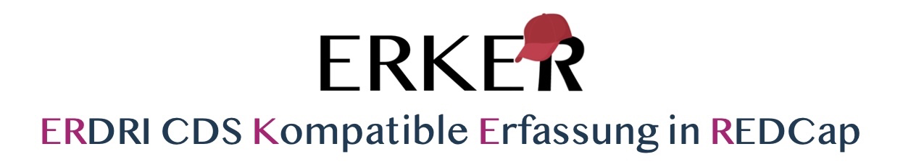

### (ERDRI-CDS compatible data capture in REDCap)

## Table of Contents

- [Table of Contents](#table-of-contents)
- [Project Description](#project-description)
- [Features](#features)
    - [Independent testing:](#independent-testing)
    - [ERDRI-CDS](#erdri-cds)
    - [ERKER4NARSE](#erker4narse)
    - [ERKERonFHIR](#erkeronfhir)
    - [ERKER2Phenopackets](#erker2phenopackets)
- [Installation](#installation)
    - [v1.7](#v17)
    - [Guidelines](#guidelines)
- [Resources](#resources)
- [License](#license)
- [Acknowledgments](#acknowledgments)
- [Contact](#contact)

## Project Description
The ERKER enables the data caputure of rare patients and transfers them into a standardised format according to FAIR principles (Findability, Accessibility, Interoperability, Reusability). The ERKER dataset was developed on the basis of the 
- of the ERDRI-CDS (European Rare Disease Registry Infrastructure - Common Data Set) 
  and
- the NARSE (National Registry for Rare Diseases).
  was developed.
Additional data elements were added to the ERKER dataset to provide a more accurate representation of disease and treatment progression, genotyping and phenotyping, and primary and secondary diagnoses. 

Version 1.7 is available for data entry in REDCap as DataDictionary and as ERKER_v1.7.zip in the folder "v1.7". After a project has been set up in REDCap, the form can be uploaded with it. More details can be found in the Guidelines folder.

## Features
#### Independent testing: 
You can test the form at your place. To do so, follow this link: https://redcap.charite.de/demo/surveys/?s=XKP4RH3TPXTFMKPE 
or enter the code 3DA7DPPEE on the following website https://redcap.charite.de/demo/surveys/.
Please enter <ins>no real data</ins> here.

#### ERDRI-CDS
The ERDRI CDS is located in the <b>ERDRI CDS</b> folder in English and German.

#### ERKER4NARSE
In the folder <b>ERKER4NARSE</b> you will find the detailed guidelines (so far inside the document <b>ERKER4NARSE.md</b>) for recording for the National Register for Rare Diseases (NARSE) with the ERKER.
The current version of ERKER_v1.7_NARSE is also available for download. In this form, only the NARSE-relevant data elements are displayed. All other data elements are being hidden using the REDCAP @HIDDEN function. This does not affect the import and export functionalities.

#### ERKERonFHIR
In the folder <b>ERKERonfHIR</b> relevant files for the transfer from ERKER to FHIR are stored. Mapping has been completed and profiling is in progress. As soon as the profiles have been published, you will find the corresponding link here.

#### ERKER2Phenopackets
With the subproject ERKER2Phenopackets we develop the transfer of ERKER data to Phenopackets - a computable representation of clinical data enabling deep phenotyping. For more information on the project check out https://github.com/BIH-CEI/ERKER2Phenopackets. For further use of Phenopackets please read: https://www.nature.com/articles/s41587-022-01357-4. 

## Installation 

#### v1.7
Im the folder <b>v1.7</b> the current data dictionary and the *ERKER_v1.7.zip* file for the installation in a local REDCap project are stored.
In the folder <b>previous versions</b> previous versions were stored. 
#### Guidelines
Guides for the installation of the *ERKER* in REDCap and for the (semi)automated transfer from tabular formats into the ERKER format are available in the folder <b>Guidelines</b>. The ERKER_v1.7.csv Import Template and the Jupyter Notebook to create the import template and map, orchestrate tabular data and write the ERKER_v1.7 compatible CSV file is within the folder <b>Data Import</b>.

## Resources
ERKER Data flow for the National Register of Rare diseases (NARSE):

## License

## Acknowledgments
We would like to thank all participating researchers in the development of the *ERKER* data set: 
Annic Weyersberg, Ana Grönke, Elisabeth Nyoungui, Jana Zschüntzsch, Josef Schepers, Miriam Hübner, Steffen Sander, Filip Rehburg, Adam Graefe
## Authors
- Adam Graefe (adam.graefe@bih-charite.de)
- Dr. Josef Schepers
- Filip Rehburg
- Miriam Hübner
- Steffen Sander
  
## Contact
Please write an [issue](https://github.com/BIH-CEI/ERKER/issues/new?assignees=&labels=question&projects=&template=question.md&title=%5BQUESTION%5D+Type+your+question+here) or exchange with other users in the [discussions](https://github.com/BIH-CEI/ERKER/discussions) if you encounter any problems.

